<p align="center">
  
</p>

<h1 align="center">
  <code>Kise0143</code>
</h1>

<p align="center">
  <b>Cybersecurity Explorer</b>
  &nbsp;•&nbsp;
  Red Team
  &nbsp;•&nbsp;
  Blue Team
  &nbsp;•&nbsp;
  Builder
</p>

<p align="center">
  <code>defend()</code>
  &nbsp;•&nbsp;
  <code>detect()</code>
  &nbsp;•&nbsp;
  <code>analyze()</code>
  &nbsp;•&nbsp;
  <code>break_things_safely()</code>
</p>

---

## `> SYSTEM_STATUS`

```text
┌────────────────────────────────────────┐
│ USER       : Kise0143                  │
│ ROLE       : Cybersecurity Explorer    │
│ MODE       : RED // BLUE               │
│ STATUS     : LEARNING                  │
│ OBJECTIVE  : UNDERSTAND. TEST. DEFEND  │
└────────────────────────────────────────┘
```

```text
┌────────────────────────────────────────┐
│ CONNECTION                             │
│                                        │
│ IP       : 127.0.0.1                   │
│ HOST     : github.com/Kise0143         │
│ UPTIME   : 24/7                        │
│ FOCUS    : Learn • Build • Secure      │
└────────────────────────────────────────┘
```

---

## `> OPERATIONS`

### 🔴 RED TEAM

```text
ATTACK_SURFACE
│
├── Reconnaissance
├── Enumeration
├── Web Security
├── Vulnerability Research
├── Exploitation Fundamentals
└── Adversary Simulation
```

**Objective**

Understand how systems fail, identify weak points, study attacker behavior, and safely reproduce attacks inside controlled environments.

`MODE: THINK LIKE THE ADVERSARY`

### 🔵 BLUE TEAM

```text
DEFENSE_LAYER
│
├── Log Analysis
├── Threat Detection
├── Incident Response
├── Network Monitoring
├── System Hardening
└── Threat Hunting
```

**Objective**

Detect suspicious behavior, investigate events, understand attacker traces, and strengthen systems before real damage occurs.

`MODE: THINK LIKE THE DEFENDER`

---

## `> ARSENAL`

<p align="center">
  
</p>

```text
OPERATING SYSTEMS    Linux
SCRIPTING            Python / Bash
VERSION CONTROL      Git / GitHub
LAB ENVIRONMENT      Virtual Machines
NETWORKING           Packet Analysis
INTEREST             Security / Detection / Automation
```

---

## `> CURRENT_MISSION`

```diff
+ Strengthen Linux fundamentals
+ Improve networking knowledge
+ Learn practical cybersecurity workflows
+ Build security-focused projects
+ Practice ethical penetration testing
+ Understand both offense and defense
```

```text
MISSION_STATUS : ACTIVE
PROGRESS       : ███████░░░░░░░░░░
NEXT_LEVEL     : PRACTICAL EXPERIENCE
```

---

## `> PROJECT_VAULT`

### 🛡️ Security Lab

Personal cybersecurity environment for experimenting with Linux, networking, detection, and defensive security concepts.

`STATUS: BUILDING`

### 🔍 Log Analyzer

A future project focused on parsing security logs, identifying suspicious activity, and highlighting unusual events.

`STATUS: PLANNED`

### ⚔️ Red vs Blue Lab

A controlled virtual environment where offensive techniques can be tested while defensive monitoring watches the activity.

`STATUS: PLANNED`

---

## `> SECURITY_PRINCIPLE`

```text
01  Understand the system.

02  Understand how it breaks.

03  Understand how to detect it.

04  Understand how to defend it.
```

> Security is not only about attacking or defending.  
> It is about understanding what happens between both sides.

---

## `> ACTIVITY`

<p align="center">
  
</p>

<p align="center">
  
</p>

---

<p align="center">
  <code>&lt; ACCESS_GRANTED // KEEP_LEARNING /&gt;</code>
</p>

<p align="center">
  <sub>SYSTEM ONLINE • SECURITY MODE ACTIVE</sub>
</p>
